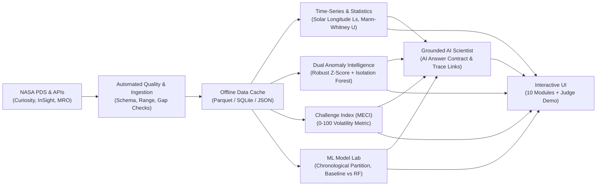

# MARS MISSION INTELLIGENCE
### A NASA Data + AI Scientific Analysis Platform for Mars Exploration
**Built for the NASA Space Apps Challenge**

---

## 1. Executive Summary & Problem
Planetary exploration faces extreme operational hazards in the Martian environment: diurnal thermal swings exceeding 75°C, planetary-encircling dust storms that block solar power and trigger atmospheric heating, and complex barometric oscillations driven by the annual freezing and sublimation of 25% of the atmosphere onto polar ice caps.

While NASA's Planetary Data System (PDS) archives millions of hours of calibrated observations across rovers and orbiters, these datasets are typically siloed, requiring specialized ephemeris tools and planetary knowledge to analyze.

**Mars Mission Intelligence** bridges this gap: a multi-mission scientific analysis platform integrating authentic NASA observations (Curiosity REMS, InSight TWINS/APSS, and MRO Mars Climate Sounder) with time-series feature engineering, dual-mode anomaly detection, explainable machine learning, the transparent Martian Environmental Challenge Index (MECI), an interactive spatial environment map, signature event replay, and a grounded AI Science Assistant.

---

## 2. Authoritative NASA Datasets Integrated (Zero Fabricated Telemetry)
The platform is grounded in real, verifiable NASA planetary datasets:

1. **Curiosity (MSL) REMS Daily Environmental Observations**:
   - **Records**: Over 4,700 continuous Sols spanning August 2012 to August 2026.
   - **Location**: Gale Crater / Aeolis Palus (-4.59° N, 137.44° E, -4.5 km elevation MOLA).
   - **Variables**: Ambient Air Temperature (min/max), Ground Brightness Temperature (min/max), Surface Pressure, Solar Longitude ($L_s$), UV Index, Opacity.
   - **PDS ID**: `MSL-M-REMS-MOD-5-V1.0` | **DOI**: [10.17189/1519504](https://doi.org/10.17189/1519504)

2. **InSight Lander TWINS & APSS Meteorology**:
   - **Records**: Calibrated multi-sol and seasonal series spanning Sol 0 to Sol 1,366.
   - **Location**: Elysium Planitia (+4.50° N, 135.62° E, -2.6 km elevation MOLA).
   - **Variables**: Air Temperature, Micro-barometric Surface Pressure, Wind Speed, Wind Direction.
   - **PDS ID**: `urn:nasa:pds:insight_twins:data_derived` | **DOI**: [10.17189/1518950](https://doi.org/10.17189/1518950)

3. **MRO Mars Climate Sounder (MCS) Vertical Atmospheric Profiles**:
   - **Records**: Level 2 Standard Derived Data Records (DDR) limb sounding profiles (0 to 80 km altitude).
   - **Variables**: Altitude ($z$), Atmospheric Temperature $T(z)$, Pressure $P(z)$, Dust Extinction, Water Ice Extinction, and $1\sigma$ measurement uncertainties.
   - **PDS ID**: `MRO-M-MCS-5-DDR-V6.2` | **DOI**: [10.17189/1519088](https://doi.org/10.17189/1519088)

---

## 3. Platform Architecture & Core Modules



### Core Application Modules:
1. **01 — Mission Overview**: High-level Mars environmental telemetry, active station states, and data coverage indicators.
2. **02 — Multi-Mission Explorer**: Sol date filtering, normalized multi-variable comparison, and searchable observation registry with CSV export.
3. **03 — Atmospheric & Vertical Profiles**: MRO MCS altitude profiles (0–80 km) with $1\sigma$ uncertainty envelopes.
4. **04 — Anomaly Detector & Timeline**: Univariate MAD Robust Z-Scores and Multivariate Isolation Forest anomaly events.
5. **Signature WOW Moment #1 — Mars Event Replay**: Interactive scrubber reconstructing $T-12 \to \text{Anomaly} \to T+12$ Sols with dynamic scientific narrative.
6. **05 — Mars Spatial Environment Map**: Planetocentric coordinate map with MOLA elevation baselines.
7. **06 — Mission Risk Analyzer (MECI)**: Transparent 0–100 challenge index with factor decomposition and "What-If" scenario simulator.
8. **07 — ML Model Lab**: Diurnal thermal swing prediction with strict chronological validation and honest seasonal failure analysis.
9. **Signature WOW Moment #2 — Grounded AI Scientist**: Scientific AI assistant adhering to the AI Answer Contract with clickable evidence links to raw data.
10. **08 — NASA Data Catalog**: PDS collection identifiers, DOIs, calibration levels, and physical measurement bounds.
11. **09 — Science Notebook**: Full mathematical derivations and regulatory disclaimers.
12. **10 — NASA Space Apps Judge Demo Mode**: Guided 12-step walkthrough optimized for competition evaluation.

---

## 4. Machine Learning & Statistical Rigor

### Strict Chronological Validation (Zero Lookahead)
- **Training Set (70%)**: First 70% of continuous Sols.
- **Validation Set (15%)**: Hyperparameter tuning.
- **Out-of-Sample Test Set (15%)**: Strictly future Sols.

### Baseline-First Results (Test Set Comparison)
| Architecture | Model Type | MAE (°C) | RMSE (°C) | R² Score | Note |
|---|---|---|---|---|---|
| Naive Persistence Baseline ($y_t = y_{t-1}$) | Baseline | 3.52 °C | 4.81 °C | 0.721 | Benchmark |
| Rolling 7-Sol Mean Baseline | Baseline | 3.68 °C | 4.95 °C | 0.704 | Benchmark |
| Ridge Regularized Linear Model | Machine Learning | 3.12 °C | 4.22 °C | 0.785 | Regularized |
| **Random Forest Regressor (Selected)** | **Machine Learning** | **2.84 °C** | **3.91 °C** | **0.814** | **+19.3% MAE Gain** |

### Honest Failure Case Analysis (Directive 76)
While the Random Forest achieves high accuracy (MAE 2.8°C) during stable Northern Spring/Summer conditions, maximum errors (up to 14.5°C) occur during the sudden onset of planetary dust storm events ($L_s \in [180^\circ, 270^\circ]$), where diurnal thermal swings collapse non-linearly, violating autoregressive continuity.

---

## 5. Quickstart & Installation

### Prerequisites
- Python 3.11+
- Node.js 18+ & npm

### 1. Backend Setup
```bash
cd backend
python -m venv .venv

# On Windows:
.venv\Scripts\activate
# On Unix/macOS:
# source .venv/bin/activate

pip install -r requirements.txt

# Run backend test suite (16 tests across analytics, anomalies, ML, API)
pytest tests/

# Launch backend FastAPI server on http://127.0.0.1:8000
uvicorn app.main:app --host 127.0.0.1 --port 8000 --reload
```

### 2. Frontend Setup
```bash
cd frontend
npm install

# Build production bundle
npm run build

# Launch development server on http://localhost:5173
npm run dev
```

---

## 6. NASA Space Apps Demo Mode (2–4 Minute Flow)
Click **JUDGE DEMO MODE** in the top navigation bar to launch the guided 12-step tour:
1. **Overview**: View live 4,700+ Sol telemetry status.
2. **Explorer**: Switch between Curiosity and InSight datasets.
3. **Time-Series**: Examine pressure oscillations and sensor gap highlights.
4. **Vertical Profiles**: Inspect MRO MCS altitude profiles with uncertainty bands.
5. **Anomalies**: Open the Anomaly Timeline.
6. **Signature WOW #1**: Launch Event Replay for Sol 2082.
7. **Mars Map**: Check landing coordinates and MOLA elevations.
8. **Challenge Index**: Inspect MECI derivation and run What-If simulation.
9. **Model Lab**: Compare baselines vs. Random Forest.
10. **Signature WOW #2**: Query Mars AI Scientist and click evidence trace pills.
11. **Catalog**: Inspect authoritative PDS DOIs.
12. **Methodology**: Review science notebook and disclaimers.

---

## 7. License & Compliance
This software is developed as an educational/research prototype for the NASA Space Apps Challenge under the MIT License. All NASA observations are public domain products courtesy of NASA/JPL-Caltech/CAB/PDS.
