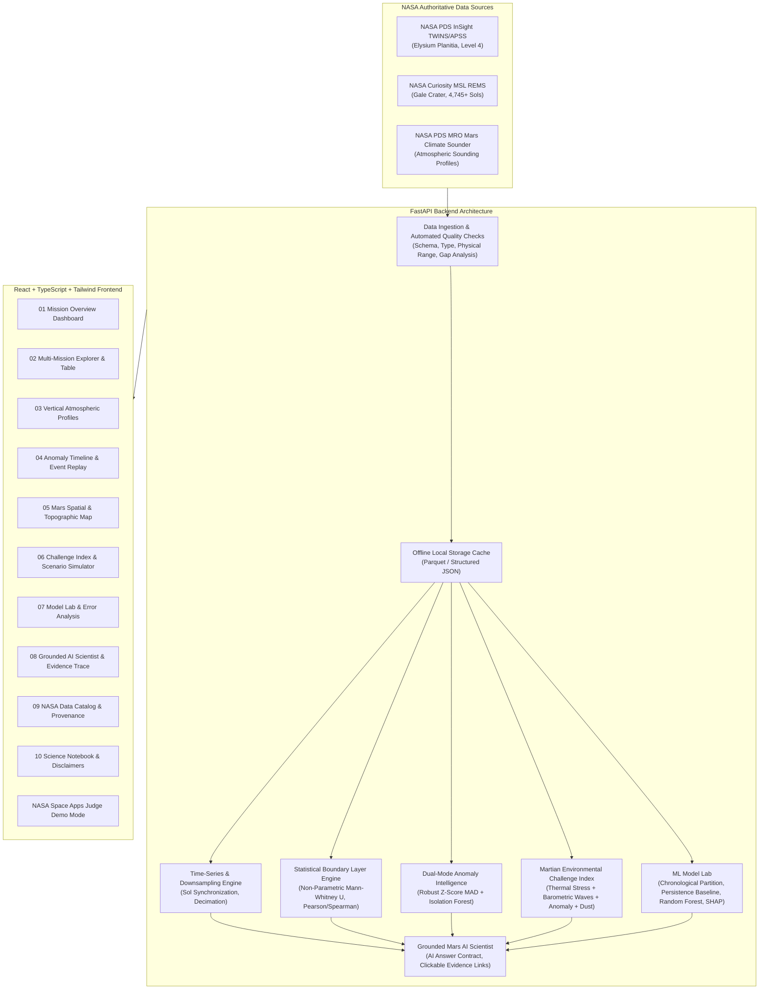

# Architecture Document: Mars Mission Intelligence

A NASA Data + AI Scientific Analysis Platform for Mars Exploration.

## System Components

### 1. Data Ingestion & Quality Layer (`backend/app/data/`)
- **Adapters**: Connects to the official NASA Mars Weather API feeds and mirrors NASA PDS4 collections.
- **Data Quality Scorecard**:
  - Schema integrity check (typed Pydantic validation)
  - Physical sanity checks (-130°C to +35°C for surface temperatures, 500 Pa to 1250 Pa for surface pressure)
  - Duplicate detection and chronological monotonicity verification
  - Sensor gap tagging ($\Delta \text{Sol} > 1$) with zero silent interpolation
- **Offline Cache**: Ensures 100% platform availability even during external NASA server downtimes.

### 2. Analytical & Statistical Subsystem (`backend/app/analytics/`)
- **Martian Ephemeris & Solar Longitude ($L_s$)**: Bins observations by true orbital position, capturing eccentricity and seasonal dust liftoff.
- **Parametric & Non-Parametric Correlation**: Pearson ($r$) and Spearman ($\rho$) with sample size ($N$) and two-tailed p-values.
- **Cross-Mission Comparative Testing**: Mann-Whitney U test between Gale Crater (-4.5 km MOLA) and Elysium Planitia (-2.6 km MOLA), proving hydrostatic scale height elevation effects.

### 3. Dual-Mode Anomaly Intelligence (`backend/app/analytics/anomaly.py`)
- **Univariate**: Robust Modified Z-Score based on Median Absolute Deviation (MAD), avoiding Gaussian distortion.
- **Multivariate**: Scikit-Learn `IsolationForest` detecting anomalous joint planetary states $[T_{max}, T_{min}, \Delta T, P]$.
- **Signature Wow Moment #1 (Event Replay)**: Reconstructs surrounding telemetry ($T-12 \to T+12$ Sols) with interactive scrubbing and scientific narration.

### 4. Martian Environmental Challenge Index (MECI)
- Transparent engineering metric on a 0–100 scale:
  $$MECI = 0.35 \cdot F_{thermal} + 0.25 \cdot F_{pressure} + 0.25 \cdot F_{anomaly} + 0.15 \cdot F_{season}$$
- Factor breakdown bars and simulated What-If scenario sensitivity tool.

### 5. ML Model Lab (`backend/app/ml/`)
- Chronological time-series partition: 70% Train, 15% Validation, 15% Test.
- Compares Persistence Baseline ($y_t = y_{t-1}$) and Rolling 7-Sol Mean vs. Ridge Regression and Random Forest Regressor.
- Honest slice-based failure analysis exposing error spikes during perihelion dust storm onset.

### 6. Grounded Mars AI Scientist (`backend/app/ai/`)
- AI Answer Contract:
  - `FINDING`
  - `DATA EVIDENCE` (exact figures, Sols, and p-values)
  - `ANALYTICAL INTERPRETATION`
  - `LIMITATIONS`
  - `SOURCE`
- Refusal of false certainty for out-of-scope or unmeasured variables.
- Signature Wow Moment #2: Clickable evidence trace links directly highlighting the corresponding raw charts.
